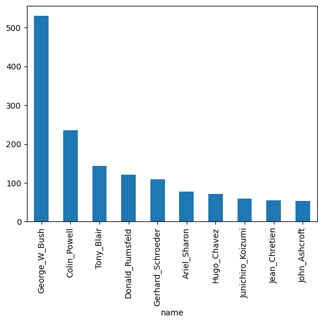
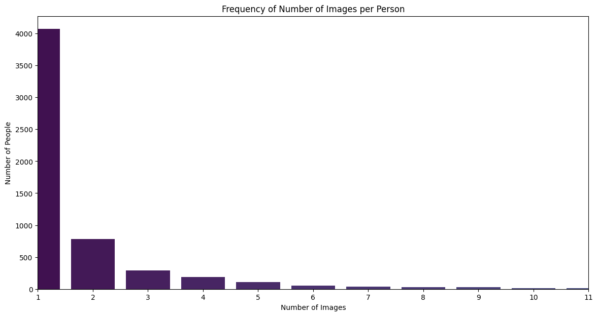

```python
import os
import pandas as pd
import matplotlib.pyplot as plt
import seaborn as sns
from skimage import io
from mpl_toolkits.mplot3d import Axes3D
import plotly.express as px
from sklearn.decomposition import PCA
import warnings
from sklearn.model_selection import train_test_split
from PIL import Image
import random

import numpy as np
from tensorflow.keras.applications.resnet50 import ResNet50, preprocess_input
from tensorflow.keras.preprocessing import image

warnings.filterwarnings("ignore")
```

---
# Exploratory Data Analysis

It's useful to understand the structure of the dataset. The LFW dataset provides several files:

- **lfw_allnames.csv**: Contains two columns, `name` (a list of all names in the dataset) and `images` (the number of images available for each name).
- **matchpairsDevTest.csv**: A random sample of 500 image pairs featuring the same individual, with columns for the name and the two image labels.
- **matchpairsDevTrain.csv**: A random sample of 1,100 image pairs featuring the same individual, with columns for the name and the image labels.
- **mismatchpairsDevTest.csv**: A random sample of 500 image pairs featuring different individuals, with columns for both names and the two image labels.
- **mismatchpairsDevTrain.csv**: A random sample of 1,100 image pairs featuring different individuals, with columns for both names and the two image labels.
- **pairs.csv**: Contains 6,000 pairs of images, both matched and mismatched. Matched pair rows contain a name and two image files, while unmatched pair rows contain a name for each of the images. For further formatting, these rows will be split into `matched_pairs` and `unmatched_pairs` data frames.
- **people.csv**: A list of names and image counts, identical to `lfw_allnames.csv` once null values are removed. It can be omitted from further analysis.
- **peopleDevTest.csv**: Contains 1,711 individuals for testing, with columns for celebrity name and image count (no overlap with `peopleDevTrain.csv`).
- **peopleDevTrain.csv**: Contains 4,038 individuals for training, with columns for celebrity name and image count (no overlap with `peopleDevTest.csv`).

---

## Data Reshaping / Cleaning


```python
raw_data_base_dir = os.path.join('..', '0_data', '0_raw', 'archive')
dataset_path = os.path.join(raw_data_base_dir,  'lfw-deepfunneled', 'lfw-deepfunneled')

lfw_allnames = pd.read_csv(f"{raw_data_base_dir}\\lfw_allnames.csv")
matchpairsDevTest = pd.read_csv(f"{raw_data_base_dir}\\matchpairsDevTest.csv")
matchpairsDevTrain = pd.read_csv(f"{raw_data_base_dir}\\matchpairsDevTrain.csv")
mismatchpairsDevTest = pd.read_csv(f"{raw_data_base_dir}\\mismatchpairsDevTest.csv")
mismatchpairsDevTrain = pd.read_csv(f"{raw_data_base_dir}\\mismatchpairsDevTrain.csv")
pairs = pd.read_csv(f"{raw_data_base_dir}\\pairs.csv")
# tidy pairs data: 
pairs = pairs.rename(columns ={'name': 'name1', 'Unnamed: 3': 'name2'})
matched_pairs = pairs[pairs["name2"].isnull()].drop("name2",axis=1)
mismatched_pairs = pairs[pairs["name2"].notnull()]
people = pd.read_csv(f"{raw_data_base_dir}\\people.csv")
# remove null values
people = people[people.name.notnull()]
peopleDevTest = pd.read_csv(f"{raw_data_base_dir}\\peopleDevTest.csv")
peopleDevTrain = pd.read_csv(f"{raw_data_base_dir}\\peopleDevTrain.csv")
```


```python
# shape data frame so there is a row per image, matched to relevant jpg file
image_paths = lfw_allnames.loc[lfw_allnames.index.repeat(lfw_allnames['images'])]
image_paths['image_path'] = 1 + image_paths.groupby('name').cumcount()
image_paths['image_path'] = image_paths.image_path.apply(lambda x: '{0:0>4}'.format(x))
image_paths['image_path'] = image_paths.name + "/" + image_paths.name + "_" + image_paths.image_path + ".jpg"
image_paths = image_paths.drop("images",axis=1)
```

---
## Image format exploration


```python
# verify resolution of all images is consistent
widths = []
heights = []
files = image_paths.image_path
for file in files:
    path = dataset_path + "\\" + str(file)
    im = Image.open(path)
    widths.append(im.width)
    heights.append(im.height)

pd.DataFrame({'height':heights,'width':widths}).describe()

# all 250 x 250 resolution
```


<div>
<style scoped>
    .dataframe tbody tr th:only-of-type {
        vertical-align: middle;
    }

    .dataframe tbody tr th {
        vertical-align: top;
    }

    .dataframe thead th {
        text-align: right;
    }
</style>
<table border="1" class="dataframe">
  <thead>
    <tr style="text-align: right;">
      <th></th>
      <th>height</th>
      <th>width</th>
    </tr>
  </thead>
  <tbody>
    <tr>
      <th>count</th>
      <td>13233.0</td>
      <td>13233.0</td>
    </tr>
    <tr>
      <th>mean</th>
      <td>250.0</td>
      <td>250.0</td>
    </tr>
    <tr>
      <th>std</th>
      <td>0.0</td>
      <td>0.0</td>
    </tr>
    <tr>
      <th>min</th>
      <td>250.0</td>
      <td>250.0</td>
    </tr>
    <tr>
      <th>25%</th>
      <td>250.0</td>
      <td>250.0</td>
    </tr>
    <tr>
      <th>50%</th>
      <td>250.0</td>
      <td>250.0</td>
    </tr>
    <tr>
      <th>75%</th>
      <td>250.0</td>
      <td>250.0</td>
    </tr>
    <tr>
      <th>max</th>
      <td>250.0</td>
      <td>250.0</td>
    </tr>
  </tbody>
</table>
</div>


---
## Further data exploration


```python
image_paths['name'].value_counts()[:10].plot(kind = "bar")
```


    <Axes: xlabel='name'>


    

    


```python
ind_counts = image_paths.groupby('name').count().image_path
print(str(sum(ind_counts[ind_counts==1])) + " individuals, which is " + str(round(100*(sum(ind_counts[ind_counts==1])/sum(ind_counts)))) + "% of the total individuals considered, are only represented by a single image in this dataset.")
```

    4069 individuals, which is 31% of the total individuals considered, are only represented by a single image in this dataset.
    


```python
random_index = random.randint(0, len(image_paths) - 1)
random_image_path = dataset_path + "\\" + str(image_paths.image_path.iloc[random_index])
im = Image.open(random_image_path)
plt.imshow(im)
plt.axis('off')  # Hide axes
plt.show()
```


    

    


```python
image_counts = lfw_allnames['images'].value_counts().sort_index()
plt.figure(figsize=(14, 7))
sns.barplot(x=image_counts.index, y=image_counts.values, palette='viridis')
plt.title('Frequency of Number of Images per Person')
plt.xlabel('Number of Images')
plt.ylabel('Number of People')
plt.xlim(0, 10)
plt.show()
```


    

    


```python
model = ResNet50(weights='imagenet', include_top=False, pooling='avg')

def load_and_preprocess_image(img_path, dataset_base_path):
    full_path = os.path.join(dataset_base_path, img_path)
    img = image.load_img(full_path, target_size=(250, 250))
    img_data = image.img_to_array(img)
    img_data = np.expand_dims(img_data, axis=0)
    img_data = preprocess_input(img_data)
    return img_data

def get_vector_representation(img_path):
    img_data = load_and_preprocess_image(img_path, dataset_path)
    vector = model.predict(img_data)
    return vector.flatten()

def plot_3d_vectors(vectors, labels):
    pca = PCA(n_components=3)
    reduced_vectors = pca.fit_transform(vectors)

    fig = px.scatter_3d(
        x=reduced_vectors[:, 0],
        y=reduced_vectors[:, 1],
        z=reduced_vectors[:, 2],
        text=labels
    )
    
    fig.update_traces(marker=dict(size=5), selector=dict(mode='markers'))
    fig.update_layout(
        title='3D PCA of Image Vectors',
        scene=dict(
            xaxis=dict(showbackground=False, showgrid=False),
            yaxis=dict(showbackground=False, showgrid=False),
            zaxis=dict(showbackground=False, showgrid=False)
        )
    )
    fig.show()

def visualize_random_images(image_paths_df, n=10):
    selected_people = random.sample(list(image_paths_df['name'].unique()), n)
    
    vectors = []
    labels = []

    for person in selected_people:
        person_images = image_paths_df[image_paths_df['name'] == person]
        
        for img_path in person_images['image_path'].tolist():
            vector = get_vector_representation(img_path)
            vectors.append(vector)
            labels.append(person)

    plot_3d_vectors(np.array(vectors), labels)

visualize_random_images(image_paths)
```

    1/1 ━━━━━━━━━━━━━━━━━━━━ 2s 2s/step
    1/1 ━━━━━━━━━━━━━━━━━━━━ 0s 138ms/step
    1/1 ━━━━━━━━━━━━━━━━━━━━ 0s 134ms/step
    1/1 ━━━━━━━━━━━━━━━━━━━━ 0s 123ms/step
    1/1 ━━━━━━━━━━━━━━━━━━━━ 0s 126ms/step
    1/1 ━━━━━━━━━━━━━━━━━━━━ 0s 121ms/step
    1/1 ━━━━━━━━━━━━━━━━━━━━ 0s 119ms/step
    1/1 ━━━━━━━━━━━━━━━━━━━━ 0s 117ms/step
    1/1 ━━━━━━━━━━━━━━━━━━━━ 0s 121ms/step
    1/1 ━━━━━━━━━━━━━━━━━━━━ 0s 121ms/step
    1/1 ━━━━━━━━━━━━━━━━━━━━ 0s 123ms/step
    1/1 ━━━━━━━━━━━━━━━━━━━━ 0s 125ms/step
    1/1 ━━━━━━━━━━━━━━━━━━━━ 0s 119ms/step
    


<div>                            <div id="3846e2f8-d2af-4a2a-a533-f3a23b81f4c7" class="plotly-graph-div" style="height:525px; width:100%;"></div>            <script type="text/javascript">                require(["plotly"], function(Plotly) {                    window.PLOTLYENV=window.PLOTLYENV || {};                                    if (document.getElementById("3846e2f8-d2af-4a2a-a533-f3a23b81f4c7")) {                    Plotly.newPlot(                        "3846e2f8-d2af-4a2a-a533-f3a23b81f4c7",                        [{"hovertemplate":"x=%{x}\u003cbr\u003ey=%{y}\u003cbr\u003ez=%{z}\u003cbr\u003etext=%{text}\u003cextra\u003e\u003c\u002fextra\u003e","legendgroup":"","marker":{"color":"#636efa","symbol":"circle"},"mode":"markers+text","name":"","scene":"scene","showlegend":false,"text":["Elvis_Costello","Jan_van_Breda_Kolff","Margaret_Hasley","Matt_Dillon","Matt_Dillon","Matt_Dillon","Jenna_Elfman","Masahiko_Nagasawa","Masahiko_Nagasawa","Chang_Tso","Sasha_Cohen","Hama_Arba_Diallo","Takuma_Sato"],"x":[-6.394112,-9.34082,-12.773934,4.506132,-1.4050589,2.9075127,3.356103,4.2466617,13.499978,-10.66881,18.69762,3.5348237,-10.166084],"y":[-1.6112515,-2.3652935,1.4028156,-8.038031,-4.47634,-0.70108926,-10.423616,15.573586,13.4641285,10.45992,-2.6076465,-10.482468,-0.1947],"z":[2.0645363,-1.7221042,13.0969515,-8.780905,-5.172491,-6.1478786,3.3644893,1.1180042,-3.886059,-6.297791,13.161915,-5.137866,4.3392024],"type":"scatter3d"}],                        {"template":{"data":{"histogram2dcontour":[{"type":"histogram2dcontour","colorbar":{"outlinewidth":0,"ticks":""},"colorscale":[[0.0,"#0d0887"],[0.1111111111111111,"#46039f"],[0.2222222222222222,"#7201a8"],[0.3333333333333333,"#9c179e"],[0.4444444444444444,"#bd3786"],[0.5555555555555556,"#d8576b"],[0.6666666666666666,"#ed7953"],[0.7777777777777778,"#fb9f3a"],[0.8888888888888888,"#fdca26"],[1.0,"#f0f921"]]}],"choropleth":[{"type":"choropleth","colorbar":{"outlinewidth":0,"ticks":""}}],"histogram2d":[{"type":"histogram2d","colorbar":{"outlinewidth":0,"ticks":""},"colorscale":[[0.0,"#0d0887"],[0.1111111111111111,"#46039f"],[0.2222222222222222,"#7201a8"],[0.3333333333333333,"#9c179e"],[0.4444444444444444,"#bd3786"],[0.5555555555555556,"#d8576b"],[0.6666666666666666,"#ed7953"],[0.7777777777777778,"#fb9f3a"],[0.8888888888888888,"#fdca26"],[1.0,"#f0f921"]]}],"heatmap":[{"type":"heatmap","colorbar":{"outlinewidth":0,"ticks":""},"colorscale":[[0.0,"#0d0887"],[0.1111111111111111,"#46039f"],[0.2222222222222222,"#7201a8"],[0.3333333333333333,"#9c179e"],[0.4444444444444444,"#bd3786"],[0.5555555555555556,"#d8576b"],[0.6666666666666666,"#ed7953"],[0.7777777777777778,"#fb9f3a"],[0.8888888888888888,"#fdca26"],[1.0,"#f0f921"]]}],"heatmapgl":[{"type":"heatmapgl","colorbar":{"outlinewidth":0,"ticks":""},"colorscale":[[0.0,"#0d0887"],[0.1111111111111111,"#46039f"],[0.2222222222222222,"#7201a8"],[0.3333333333333333,"#9c179e"],[0.4444444444444444,"#bd3786"],[0.5555555555555556,"#d8576b"],[0.6666666666666666,"#ed7953"],[0.7777777777777778,"#fb9f3a"],[0.8888888888888888,"#fdca26"],[1.0,"#f0f921"]]}],"contourcarpet":[{"type":"contourcarpet","colorbar":{"outlinewidth":0,"ticks":""}}],"contour":[{"type":"contour","colorbar":{"outlinewidth":0,"ticks":""},"colorscale":[[0.0,"#0d0887"],[0.1111111111111111,"#46039f"],[0.2222222222222222,"#7201a8"],[0.3333333333333333,"#9c179e"],[0.4444444444444444,"#bd3786"],[0.5555555555555556,"#d8576b"],[0.6666666666666666,"#ed7953"],[0.7777777777777778,"#fb9f3a"],[0.8888888888888888,"#fdca26"],[1.0,"#f0f921"]]}],"surface":[{"type":"surface","colorbar":{"outlinewidth":0,"ticks":""},"colorscale":[[0.0,"#0d0887"],[0.1111111111111111,"#46039f"],[0.2222222222222222,"#7201a8"],[0.3333333333333333,"#9c179e"],[0.4444444444444444,"#bd3786"],[0.5555555555555556,"#d8576b"],[0.6666666666666666,"#ed7953"],[0.7777777777777778,"#fb9f3a"],[0.8888888888888888,"#fdca26"],[1.0,"#f0f921"]]}],"mesh3d":[{"type":"mesh3d","colorbar":{"outlinewidth":0,"ticks":""}}],"scatter":[{"fillpattern":{"fillmode":"overlay","size":10,"solidity":0.2},"type":"scatter"}],"parcoords":[{"type":"parcoords","line":{"colorbar":{"outlinewidth":0,"ticks":""}}}],"scatterpolargl":[{"type":"scatterpolargl","marker":{"colorbar":{"outlinewidth":0,"ticks":""}}}],"bar":[{"error_x":{"color":"#2a3f5f"},"error_y":{"color":"#2a3f5f"},"marker":{"line":{"color":"#E5ECF6","width":0.5},"pattern":{"fillmode":"overlay","size":10,"solidity":0.2}},"type":"bar"}],"scattergeo":[{"type":"scattergeo","marker":{"colorbar":{"outlinewidth":0,"ticks":""}}}],"scatterpolar":[{"type":"scatterpolar","marker":{"colorbar":{"outlinewidth":0,"ticks":""}}}],"histogram":[{"marker":{"pattern":{"fillmode":"overlay","size":10,"solidity":0.2}},"type":"histogram"}],"scattergl":[{"type":"scattergl","marker":{"colorbar":{"outlinewidth":0,"ticks":""}}}],"scatter3d":[{"type":"scatter3d","line":{"colorbar":{"outlinewidth":0,"ticks":""}},"marker":{"colorbar":{"outlinewidth":0,"ticks":""}}}],"scattermapbox":[{"type":"scattermapbox","marker":{"colorbar":{"outlinewidth":0,"ticks":""}}}],"scatterternary":[{"type":"scatterternary","marker":{"colorbar":{"outlinewidth":0,"ticks":""}}}],"scattercarpet":[{"type":"scattercarpet","marker":{"colorbar":{"outlinewidth":0,"ticks":""}}}],"carpet":[{"aaxis":{"endlinecolor":"#2a3f5f","gridcolor":"white","linecolor":"white","minorgridcolor":"white","startlinecolor":"#2a3f5f"},"baxis":{"endlinecolor":"#2a3f5f","gridcolor":"white","linecolor":"white","minorgridcolor":"white","startlinecolor":"#2a3f5f"},"type":"carpet"}],"table":[{"cells":{"fill":{"color":"#EBF0F8"},"line":{"color":"white"}},"header":{"fill":{"color":"#C8D4E3"},"line":{"color":"white"}},"type":"table"}],"barpolar":[{"marker":{"line":{"color":"#E5ECF6","width":0.5},"pattern":{"fillmode":"overlay","size":10,"solidity":0.2}},"type":"barpolar"}],"pie":[{"automargin":true,"type":"pie"}]},"layout":{"autotypenumbers":"strict","colorway":["#636efa","#EF553B","#00cc96","#ab63fa","#FFA15A","#19d3f3","#FF6692","#B6E880","#FF97FF","#FECB52"],"font":{"color":"#2a3f5f"},"hovermode":"closest","hoverlabel":{"align":"left"},"paper_bgcolor":"white","plot_bgcolor":"#E5ECF6","polar":{"bgcolor":"#E5ECF6","angularaxis":{"gridcolor":"white","linecolor":"white","ticks":""},"radialaxis":{"gridcolor":"white","linecolor":"white","ticks":""}},"ternary":{"bgcolor":"#E5ECF6","aaxis":{"gridcolor":"white","linecolor":"white","ticks":""},"baxis":{"gridcolor":"white","linecolor":"white","ticks":""},"caxis":{"gridcolor":"white","linecolor":"white","ticks":""}},"coloraxis":{"colorbar":{"outlinewidth":0,"ticks":""}},"colorscale":{"sequential":[[0.0,"#0d0887"],[0.1111111111111111,"#46039f"],[0.2222222222222222,"#7201a8"],[0.3333333333333333,"#9c179e"],[0.4444444444444444,"#bd3786"],[0.5555555555555556,"#d8576b"],[0.6666666666666666,"#ed7953"],[0.7777777777777778,"#fb9f3a"],[0.8888888888888888,"#fdca26"],[1.0,"#f0f921"]],"sequentialminus":[[0.0,"#0d0887"],[0.1111111111111111,"#46039f"],[0.2222222222222222,"#7201a8"],[0.3333333333333333,"#9c179e"],[0.4444444444444444,"#bd3786"],[0.5555555555555556,"#d8576b"],[0.6666666666666666,"#ed7953"],[0.7777777777777778,"#fb9f3a"],[0.8888888888888888,"#fdca26"],[1.0,"#f0f921"]],"diverging":[[0,"#8e0152"],[0.1,"#c51b7d"],[0.2,"#de77ae"],[0.3,"#f1b6da"],[0.4,"#fde0ef"],[0.5,"#f7f7f7"],[0.6,"#e6f5d0"],[0.7,"#b8e186"],[0.8,"#7fbc41"],[0.9,"#4d9221"],[1,"#276419"]]},"xaxis":{"gridcolor":"white","linecolor":"white","ticks":"","title":{"standoff":15},"zerolinecolor":"white","automargin":true,"zerolinewidth":2},"yaxis":{"gridcolor":"white","linecolor":"white","ticks":"","title":{"standoff":15},"zerolinecolor":"white","automargin":true,"zerolinewidth":2},"scene":{"xaxis":{"backgroundcolor":"#E5ECF6","gridcolor":"white","linecolor":"white","showbackground":true,"ticks":"","zerolinecolor":"white","gridwidth":2},"yaxis":{"backgroundcolor":"#E5ECF6","gridcolor":"white","linecolor":"white","showbackground":true,"ticks":"","zerolinecolor":"white","gridwidth":2},"zaxis":{"backgroundcolor":"#E5ECF6","gridcolor":"white","linecolor":"white","showbackground":true,"ticks":"","zerolinecolor":"white","gridwidth":2}},"shapedefaults":{"line":{"color":"#2a3f5f"}},"annotationdefaults":{"arrowcolor":"#2a3f5f","arrowhead":0,"arrowwidth":1},"geo":{"bgcolor":"white","landcolor":"#E5ECF6","subunitcolor":"white","showland":true,"showlakes":true,"lakecolor":"white"},"title":{"x":0.05},"mapbox":{"style":"light"}}},"scene":{"domain":{"x":[0.0,1.0],"y":[0.0,1.0]},"xaxis":{"title":{"text":"x"},"showbackground":false,"showgrid":false},"yaxis":{"title":{"text":"y"},"showbackground":false,"showgrid":false},"zaxis":{"title":{"text":"z"},"showbackground":false,"showgrid":false}},"legend":{"tracegroupgap":0},"margin":{"t":60},"title":{"text":"3D PCA of Image Vectors"}},                        {"responsive": true}                    ).then(function(){

var gd = document.getElementById('3846e2f8-d2af-4a2a-a533-f3a23b81f4c7');
var x = new MutationObserver(function (mutations, observer) {{
        var display = window.getComputedStyle(gd).display;
        if (!display || display === 'none') {{
            console.log([gd, 'removed!']);
            Plotly.purge(gd);
            observer.disconnect();
        }}
}});

// Listen for the removal of the full notebook cells
var notebookContainer = gd.closest('#notebook-container');
if (notebookContainer) {{
    x.observe(notebookContainer, {childList: true});
}}

// Listen for the clearing of the current output cell
var outputEl = gd.closest('.output');
if (outputEl) {{
    x.observe(outputEl, {childList: true});
}}

                        })                };                });            </script>        </div>

